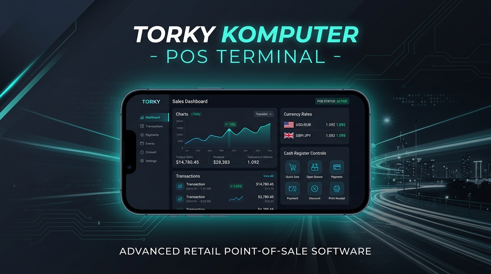

# 🖥️ Torky POS & Repair Services Management Terminal

<p align="center">
  
</p>

<p align="center">
  <a href="https://github.com/yantorky/torky-pos-terminal">
    
  </a>
  <a href="https://github.com/yantorky">
    
  </a>
  
</p>

---

## 📌 Deskripsi Sistem

**Torky POS (Point of Sale) & Repair Services Management Terminal** adalah perangkat lunak kasir terintegrasi dan pusat kontrol administrasi pengerjaan servis teknik tingkat lanjut (*enterprise-grade*) yang dirancang khusus untuk industri ritel perangkat keras komputer, pusat servis elektronik harian, serta ritel otomotif/jasa modern.

Dibuat dengan presisi tinggi demi performa cepat, aplikasi ini menjalankan sistem pembukuan terpusat, penggabungan komponen kasir (*POS Terminal*), sistem pengerjaan antrean klaim garansi & perbaikan (*Repair Queue*), penyesuaian harga impor berbasis kurs real-time, hingga simulator perakitan komputer secara instan.

Hak Cipta dan kepemilikan kode sumber sepenuhnya dipegang oleh pencipta asli, **Yan Torky (Owner Torky Komputer)**. Salinan kode ini diproteksi secara hukum untuk mencegah penggunaan komersial tanpa izin, redistribusi, atau penjiplakan tanpa persetujuan tertulis resmi.

---

## 👥 Matriks Hak Akses & Autentikasi Staf (Strict PIN-Gate)

Sistem ini menerapkan gerbang keamanan berlapis (*Multi-role Security Access*) menggunakan PIN numerik personal 4-Digit yang diverifikasi secara aman oleh mesin autentikasi internal:

| Peran | Staf Penanggung Jawab | Otoritas & Responsibilitas | Keamanan |
| :--- | :--- | :--- | :--- |
| **👑 Super Admin** | **Yan Torky** (Owner) | Kendali penuh ledger keuangan, audit transaksi kasir, modifikasi database inventaris, pembuatan kunci lisensi komersial baru, konfigurasi API utama, dan manajemen hak akses tim. | PIN Terenkripsi |
| **🛡️ Admin Utama**| **Sri Wahyuni** | Manajemen stok gudang (*Inventory Management*), registrasi nomor seri (S/N) produk, kontrol kemitraan distributor (*Supplier Ledger*), dan penyusunan katalog harga pasar. | PIN Terenkripsi |
| **💸 Operator Kasir**| **Rista Kemala Novianti** | Pemrosesan penjualan ritel (*Point of Sale checkout*), cetak nota termal digital, pemberian diskon loyalitas terdaftar (Mitra/B2B), dan penutupan shift laci kasir (*Cash Drawer*). | PIN Terenkripsi |
| **🔧 Teknisi / Mekanik**| **Nova Kesawa Duta** | Pelacakan status pengerjaan servis pelanggan, diagnosis kerusakan, alokasi suku cadang dinamis (otomatis memotong stok fisik), serta penyusunan lembar Surat Jalan Klaim Garansi. | PIN Terenkripsi |

---

## ⚡ Alur Arsitektur Sistem (Technical Topology)

Terminal ini dirancang dengan arsitektur modular yang menjamin transaksi instan tanpa tunda (*zero latency*):

```text
┌────────────────────────────────────────────────────────────────────────┐
│                        USER INTERFACE (VITE + REACT)                   │
├─────────────────────┬───────────────────────────┬──────────────────────┤
│  Point of Sale (POS)│  Repair Job Tracker (S/N) │  PC Builder Engine   │
└──────────┬──────────┴─────────────┬─────────────┴──────────┬───────────┘
           │                         │                        │
           ▼                         ▼                        ▼
┌────────────────────────────────────────────────────────────────────────┐
│                        SECURE DESKTOP PIN GATEWAY                      │
├────────────────────────────────────────────────────────────────────────┤
│                     LOCAL STORAGE STATE & LEDGER                       │
└────────────────────────────────────┬───────────────────────────────────┘
                                     │
                                     ▼
                      ┌─────────────────────────────┐
                      │    CENTRAL DATABASE STATE   │
                      │   (Automatic Stock Update)  │
                      └─────────────────────────────┘
```

---

## 🌟 Fitur Unggulan

*   **🛡️ Secure Keyboard Control**: Antarmuka keypad PIN virtual sentuh taktil untuk meminimalkan pembongkaran data (*keylogging*) jahat di komputer publik.
*   **🛒 Ritel POS & Nota Struk Digital**:
    *   Mendukung regulasi fiskal terkini (PPN 12%, 11%, atau Pajak Bebas Ritel 0%).
    *   Klasifikasi kemitraan klien berlapis (Personal, Mitra Ritel Terdaftar, Corporate B2B) dengan perhitungan diskon harga grosir otomatis.
    *   Format ekspor nota termal standar logistik yang kompatibel dengan printer termal POS ukuran 58mm & 80mm.
*   **🔧 Diagnosis Jasa Reparasi & Suku Cadang Dinamis**:
    *   Pelacakan status pengerjaan komprehensif mulai dari *Menunggu Antrean*, *Investigasi*, *Menunggu Suku Cadang*, hingga *Selesai*.
    *   Integrasi stok dinamis: Alokasi onderdil ke tiket servis otomatis memotong data inventaris secara real-time.
    *   Sistem ekspor instan dari tiket servis selesai menjadi transaksi kasir POS (*Bridge-to-POS*) tanpa input manual ulang.
*   **🖥️ PC Builder Simulator & Kompatibilitas**:
    *   Konfigurasikan spesifikasi PC impian pelanggan berbekal fitur deteksi otomatis batas daya daya (*PSU Wattage Calculator*), estimasi berat kargo fisik, serta validasi kecocokan slot suku cadang.
    *   Satu-klik konversi spesifikasi menjadi nota pembayaran terminal kasir.

---

## 🔒 Proteksi Keamanan & Aktivasi Lisensi Produksi

Aplikasi ini menggunakan skema lisensi keamanan **"Authorized Deployment"**:

*   **Mode Pengujian (Sandbox)**: Berjalan secara default untuk keperluan demo fungsionalitas lokal.
*   **Mode Produksi (Licensed)**: Sistem memindai identitas periferal mesin fisik pelanggan saat instalasi untuk menghasilkan **Installation ID (Signature ID)** yang unik.
*   **Aktivasi Resmi**: Kunci lisensi (*Activation Key*) yang valid didekripsi menggunakan algoritma internal yang diterbitkan eksklusif oleh pemegang hak cipta resmi:
    *   **Penerbit Lisensi Tunggal**: Yan Torky (Torky Komputer)
    *   **Kontak Resmi**: [torkykomputer@gmail.com](mailto:torkykomputer@gmail.com)

---

## 💻 Tech Stack

*   **Antarmuka Pengguna**: React JS (v18+) & Vite JS (Kecepatan muat sub-detik).
*   **Bahasa Program**: TypeScript (Type-Safe penuh, menghindari distorsi perhitungan desimal rupiah kasir).
*   **Sistem Styling**: Tailwind CSS (Desain modern resolusi tinggi, responsif murni dari layar tablet nirkabel hingga monitor kasir layar lebar).
*   **Mesin Animasi**: Framer Motion (`motion/react`) untuk transisi antar-menu yang taktil dan interaktif.
*   **Penyimpanan**: Manajemen penyimpanan lokal modular (*Local State Engine*) dengan enkripsi hibrida mandiri.

---

## ⚙️ Panduan Menjalankan Sistem

### 1. Kloning / Ekstrak Kode Sumber
Dapatkan folder proyek resmi dari **Torky Komputer** dan buka melalui aplikasi shell konsol Anda:
```bash
cd torky-pos-terminal
```

### 2. Pasang Dependensi
Pastikan mesin Anda telah dilengkapi dengan runtime Node.js (Direkomendasikan v18 ke atas):
```bash
npm install
```

### 3. Konfigurasi Variabel Lingkungan (.env)
Salin berkas templat konfigurasi aman:
```bash
cp .env.example .env
```

### 4. Jalankan Server Pengembangan
Aktifkan server lokal untuk proses simulasi fungsional:
```bash
npm run dev
```
Buka peramban browser Anda di alamat default: `http://localhost:3000`.

### 5. Kompilasi Produksi (Production Build)
Lakukan kompilasi untuk optimalisasi penuh kecepatan aplikasi tanpa memakan memori berlebih:
```bash
npm run build
```
Seluruh aset statis web yang dioptimalkan akan dikemas di folder `dist/` dan backend server dikompilasi secara otomatis di file tunggal `dist/server.cjs` untuk stabilitas tinggi di server lokal mana pun.

### 6. Menjalankan Server Kompilasi
```bash
npm start
```

---

## ⚖️ Lisensi Hak Cipta Kepemilikan Tunggal (Proprietary License)

Kode sumber ini dirilis di bawah lisensi proprietari yang ketat milik **Yan Torky**.

```text
DIBUAT DAN DILINDUNGI SECARA HUKUM OLEH YAN TORKY (Torky Komputer)

Dengan menggunakan, mengunduh, atau memodifikasi kode ini, Anda tunduk pada aturan berikut:
1. Dilarang keras menggunakan kode sumber ini untuk tujuan komersial, penjualan jasa POS, atau bisnis komersial eksternal di luar lisensi resmi "Torky Komputer".
2. Dilarang keras menghapus atau mengganti nama "Yan Torky" dan "Torky Komputer" sebagai pembuat asli perangkat lunak ini di halaman mana pun.
3. Modifikasi internal untuk kebutuhan riset pribadi diizinkan, namun dilarang keras menjual kembali hasil modifikasi tersebut di repositori publik mana pun tanpa persetujuan tertulis resmi.
```

---
*Salam Hormat,*  
**Yan Torky**  
*Lead IT Architect / Owner of Torky Komputer*  
*"Anda Yang Utama"*
